# CodeSnapAI 项目总体架构设计

## 文档概述

本文档详细阐述 CodeSnapAI 项目的总体架构设计，包括系统架构、核心模块设计、部署方案、技术选型以及扩展性设计。CodeSnapAI 是一个 AI 驱动的语义代码分析与智能治理平台，旨在通过深度语义分析、风险评估和 LLM 辅助，为开发团队提供全方位的代码质量保障与智能化治理能力。

---

## 1. 系统概述

### 1.1 设计目标

CodeSnapAI 的核心设计目标包括：

* **深度语义理解**：基于 Tree-sitter\[1] 构建多语言 AST 解析能力，实现跨语言的语义级代码分析
* **智能治理编排**：集成大语言模型（LLM），实现代码问题的自动检测、修复方案生成与验证
* **实时监控与反馈**：提供文件监控、增量分析与实时风险评分能力
* **可扩展架构**：采用插件化设计，支持自定义语言解析器、度量指标与治理策略
* **企业级可靠性**：支持大规模代码库分析，提供缓存机制与性能优化

### 1.2 核心能力

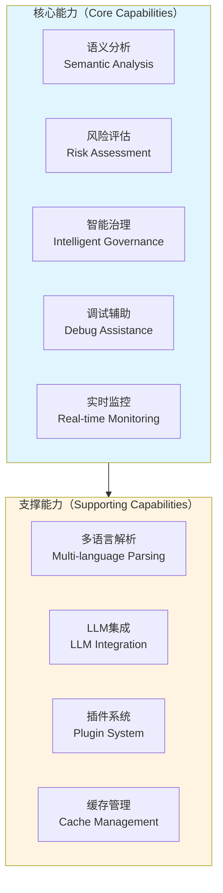

上图展示了 CodeSnapAI 的核心能力与支撑能力的关系。核心能力模块专注于为用户提供直接价值的功能，而支撑能力则确保系统的可扩展性、性能与可靠性。

---

## 2. 总体架构设计

### 2.1 分层架构

CodeSnapAI 采用经典的分层架构设计，从下至上分为基础设施层、核心引擎层、业务编排层与交互层。

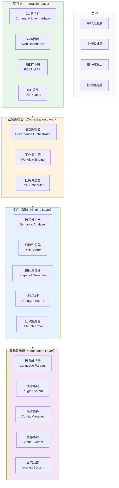

**架构说明**：

* **交互层**：提供多种用户交互方式，包括命令行工具（CLI）、Web 仪表板、REST API 以及 IDE 插件，满足不同场景的使用需求
* **业务编排层**：负责复杂业务流程的编排，包括治理工作流的自动化执行、任务调度与状态管理
* **核心引擎层**：实现系统的核心分析与处理能力，各引擎独立设计、职责单一，便于维护与扩展
* **基础设施层**：提供底层技术支撑，包括多语言 AST 解析、插件机制、配置管理与性能优化组件

### 2.2 模块依赖关系

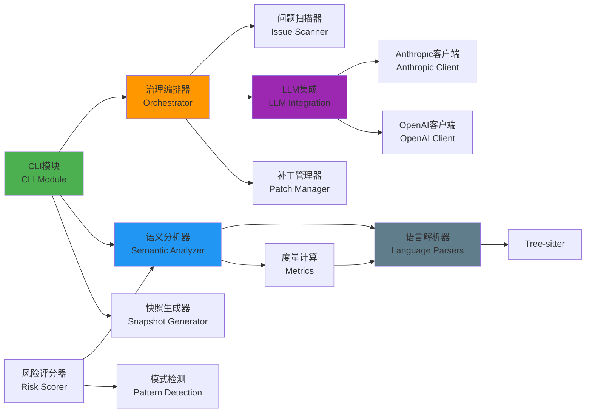

上图展示了核心模块之间的依赖关系。CLI 模块作为主要入口，协调各个功能模块的调用。治理编排器通过集成 LLM 与补丁管理器，实现自动化的代码修复流程。语义分析器与风险评分器协同工作，为治理决策提供数据支撑。

---

## 3. 核心模块详细设计

### 3.1 语义分析器（Semantic Analyzer）

语义分析器是 CodeSnapAI 的核心组件，负责将源代码转换为结构化的语义表示，并计算各类代码质量度量。

#### 3.1.1 模块架构

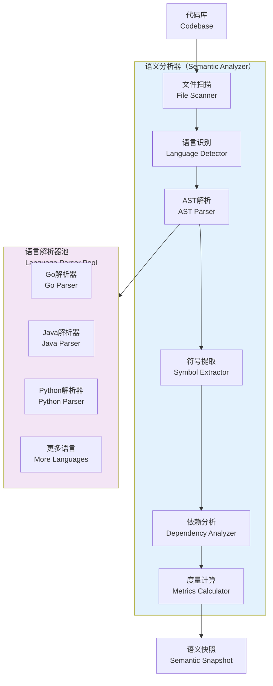

**设计要点**：

1. **文件扫描与过滤**：支持 .gitignore 规则，可配置包含/排除模式，避免分析非必要文件
2. **语言自动识别**：基于文件扩展名与内容特征，自动选择对应的语言解析器
3. **增量解析**：利用 Tree-sitter 的增量解析能力，仅重新分析变更的代码区域
4. **符号提取**：提取函数、类、变量等符号信息，建立符号表用于依赖分析
5. **度量计算**：支持圈复杂度、认知复杂度、耦合度等多种代码质量度量

#### 3.1.2 度量体系

CodeSnapAI 实现了多维度的代码质量度量体系：

| 度量类别 | 度量指标                          | 计算方法           | 应用场景     |
| ---- | ----------------------------- | -------------- | -------- |
| 复杂度  | 圈复杂度（Cyclomatic Complexity）   | 基于控制流图的独立路径数   | 识别复杂函数   |
| 复杂度  | 认知复杂度（Cognitive Complexity）   | 加权计算嵌套结构与控制流   | 评估代码可读性  |
| 耦合度  | 传入耦合（Afferent Coupling）       | 依赖当前模块的外部模块数   | 模块影响范围分析 |
| 耦合度  | 传出耦合（Efferent Coupling）       | 当前模块依赖的外部模块数   | 模块稳定性评估  |
| 可维护性 | 可维护性指数（Maintainability Index） | 综合复杂度、代码行数与注释率 | 整体质量评估   |

### 3.2 治理编排器（Governance Orchestrator）

治理编排器是实现自动化代码治理的核心组件，它协调问题扫描、LLM 修复方案生成、补丁应用与验证的完整流程。

#### 3.2.1 治理工作流

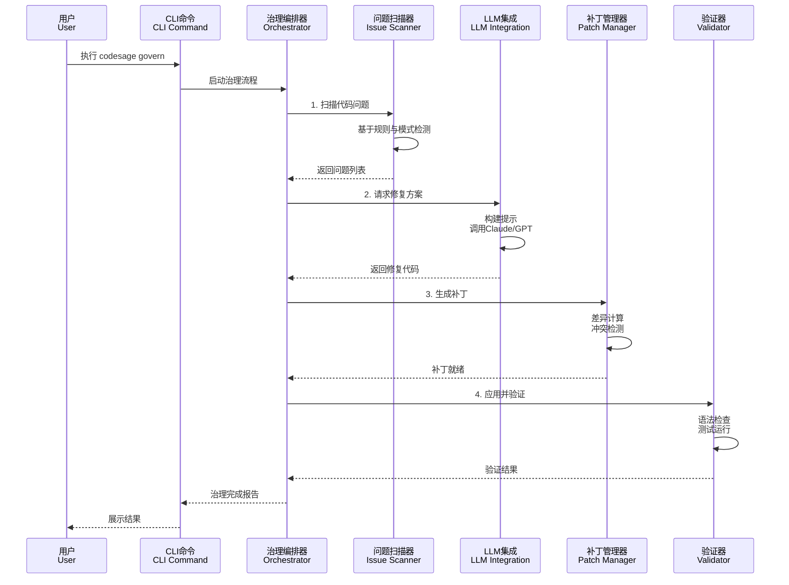

**工作流说明**：

1. **问题扫描阶段**：基于预定义规则与模式，检测代码中的潜在问题，包括复杂度过高、安全漏洞、代码异味等
2. **LLM 分析阶段**：将检测到的问题与代码上下文发送至 LLM，生成针对性的修复方案
3. **补丁应用阶段**：将 LLM 生成的修复代码与原代码进行差异计算，生成可应用的补丁文件
4. **验证阶段**：应用补丁后执行语法检查、单元测试与静态分析，确保修复不引入新问题

#### 3.2.2 LLM 集成设计

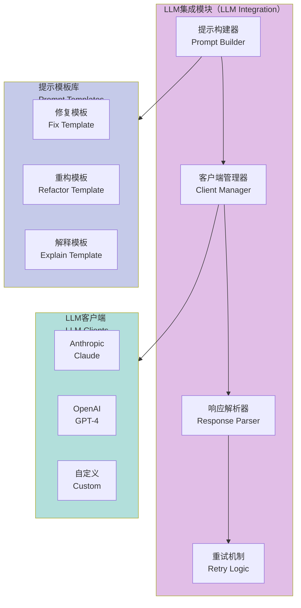

**设计特点**：

* **提示工程**：针对不同场景（修复、重构、解释）设计专用提示模板，提升 LLM 输出质量
* **多模型支持**：统一抽象层支持 Anthropic Claude、OpenAI GPT 等多种 LLM，可根据场景灵活切换
* **智能重试**：实现指数退避重试机制，处理 API 限流与临时性故障
* **响应验证**：解析 LLM 响应并进行格式验证，提取代码块与元数据

### 3.3 快照生成器（Snapshot Generator）

快照生成器负责将语义分析结果序列化为紧凑的、适合 LLM 消费的格式。

#### 3.3.1 快照结构设计

```yaml
# 快照示例结构
metadata:
  version: "1.0"
  timestamp: "2025-11-12T10:30:00Z"
  project: "my-service"
  language_distribution:
    go: 0.65
    python: 0.25
    yaml: 0.10

files:
  - path: "src/handler.go"
    language: "go"
    metrics:
      lines: 250
      complexity: 12
      maintainability: 75
    symbols:
      - name: "HandleRequest"
        type: "function"
        parameters: ["ctx", "req"]
        complexity: 8
        dependencies: ["logger", "database"]
    issues:
      - type: "high_complexity"
        line: 45
        severity: "warning"

dependencies:
  internal:
    - from: "handler.go"
      to: "service.go"
      type: "import"
  external:
    - package: "github.com/gin-gonic/gin"
      version: "v1.9.0"
```

**设计考虑**：

1. **分层结构**：顶层元数据、文件级信息、符号级细节，支持按需加载
2. **度量聚合**：在文件、包、项目多个层级聚合度量数据，便于多维度分析
3. **依赖图谱**：记录内部依赖与外部依赖，支持影响分析与依赖可视化
4. **问题关联**：将检测到的问题与具体代码位置关联，便于定位与修复

#### 3.3.2 压缩与优化

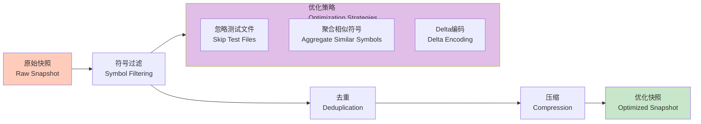

**优化策略**：

* **符号过滤**：根据配置排除私有符号、测试代码等，减少快照体积
* **去重处理**：对重复的依赖、模式信息进行去重，避免冗余存储
* **增量快照**：支持基于前一版本的增量快照，仅记录变更部分
* **压缩算法**：使用 zlib 或 lz4 进行数据压缩，平衡压缩率与解压速度

---

## 4. 部署架构

### 4.1 本地开发模式

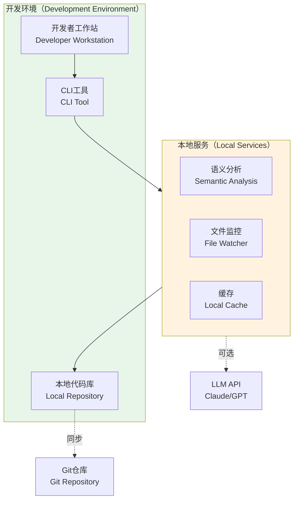

**本地模式特点**：

* **零配置启动**：开发者无需额外部署，直接通过 CLI 工具使用核心功能
* **离线能力**：语义分析、度量计算等功能可在无网络环境下运行
* **实时反馈**：文件监控模式提供代码变更的实时分析与反馈
* **缓存加速**：本地缓存 AST 与分析结果，提升重复分析的速度

### 4.2 CI/CD 集成模式

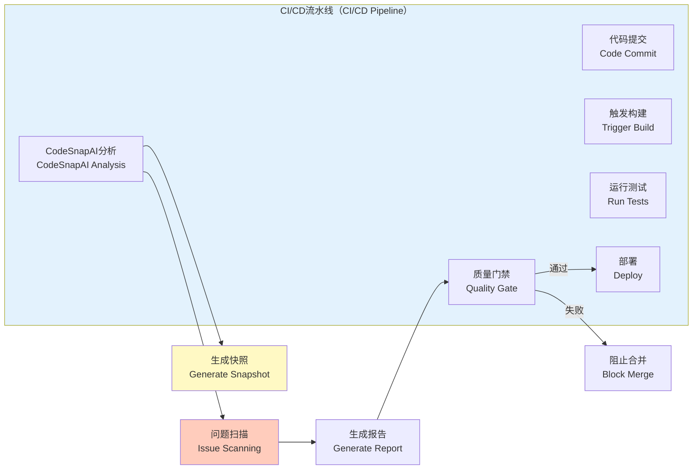

**集成模式说明**：

* **自动触发**：在 PR 提交、代码合并等事件时自动执行分析
* **质量门禁**：根据配置的阈值（如复杂度上限、风险分数）决定是否通过
* **增量分析**：仅分析变更的文件与受影响的模块，提升 CI 效率
* **报告生成**：生成 HTML、JSON 等多种格式的报告，集成至 CI 平台的界面

### 4.3 企业级部署模式

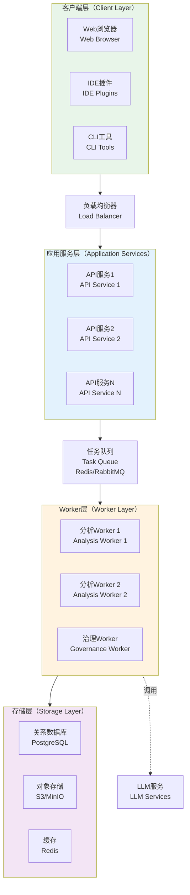

**企业级部署特点**：

1. **高可用架构**：多实例部署，通过负载均衡器分发请求，避免单点故障
2. **异步处理**：大规模代码分析任务通过消息队列异步处理，提升响应速度
3. **水平扩展**：Worker 层可根据负载动态扩缩容，应对流量峰值
4. **数据持久化**：分析结果存储至数据库与对象存储，支持历史对比与趋势分析
5. **缓存优化**：利用 Redis 缓存热点数据与分析结果，减少重复计算

---

## 5. 关键技术选型

### 5.1 核心技术栈

| 技术领域    | 选型方案                                 | 选型理由                  |
| ------- | ------------------------------------ | --------------------- |
| 编程语言    | Python 3.10+                         | 丰富的生态、优秀的 AI/ML 库支持   |
| AST 解析  | Tree-sitter\[1]                      | 增量解析、多语言支持、高性能        |
| CLI 框架  | Click\[2]                            | 简洁的 API、丰富的功能、良好的文档   |
| Web 框架  | FastAPI\[3]                          | 异步支持、自动文档生成、类型验证      |
| LLM SDK | Anthropic SDK\[4]<br/>OpenAI SDK\[5] | 官方支持、稳定可靠、功能完整        |
| 配置格式    | YAML                                 | 人类可读、支持复杂结构、广泛应用      |
| 测试框架    | pytest\[6]                           | 强大的 fixture 系统、插件生态丰富 |

### 5.2 技术决策

#### 5.2.1 为什么选择 Tree-sitter？

Tree-sitter 相比传统解析方案（如 Python 的 ast 模块、Java 的 JavaParser）具有以下优势：

1. **统一的多语言支持**：通过统一的 API 解析 30+ 种编程语言，无需为每种语言编写适配代码
2. **增量解析能力**：高效处理代码变更，仅重新解析受影响的节点，适合实时监控场景
3. **容错性**：即使代码存在语法错误，也能生成部分 AST，提升分析的鲁棒性
4. **高性能**：C 语言实现，解析速度远超纯 Python 实现的方案

#### 5.2.2 为什么集成多个 LLM？

集成 Anthropic Claude 与 OpenAI GPT 的原因：

1. **模型差异**：Claude 在代码理解与长文本处理上表现优异，GPT-4 在创造性重构方面有优势
2. **冗余保障**：当一个 API 不可用时，可自动切换至备用模型，提升服务可用性
3. **成本优化**：根据任务复杂度选择合适的模型（如简单任务使用 GPT-3.5，复杂任务使用 Claude Opus）
4. **私有部署**：预留接口支持企业自部署的开源大模型（如 Llama、Mistral）

---

## 6. 数据流设计

### 6.1 端到端分析流程

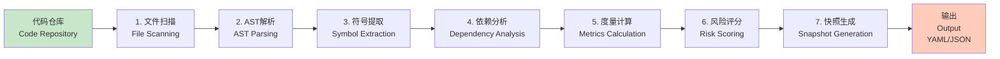

**流程说明**：

1. **文件扫描**：遍历代码库，根据 .gitignore 与配置过滤文件
2. **AST 解析**：针对每个文件调用对应的 Tree-sitter 解析器，生成语法树
3. **符号提取**：从 AST 中提取函数、类、变量等符号信息，建立符号表
4. **依赖分析**：基于 import 语句与符号引用，构建模块间的依赖关系图
5. **度量计算**：计算复杂度、耦合度等质量度量，评估代码健康度
6. **风险评分**：结合度量数据与模式检测结果，为每个文件/函数打分
7. **快照生成**：将分析结果序列化为结构化格式，供后续消费

### 6.2 治理工作流数据流

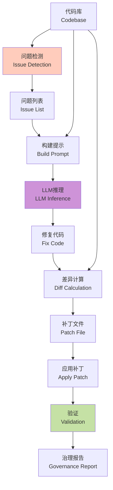

**数据流特点**：

* **上下文传递**：将代码上下文（如函数定义、依赖关系）传递给 LLM，提升修复质量
* **结构化输出**：LLM 输出遵循预定义的 JSON Schema，便于解析与验证
* **双向验证**：应用补丁前后均进行语法与测试验证，确保修复不破坏功能

---

## 7. 扩展性设计

### 7.1 插件系统架构

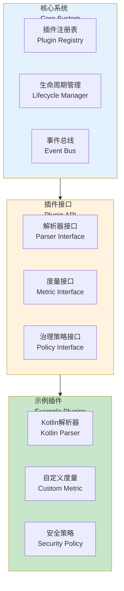

**插件机制特点**：

1. **接口抽象**：定义清晰的插件接口，降低插件开发门槛
2. **动态加载**：支持运行时加载插件，无需重启应用
3. **沙箱隔离**：插件在受限环境中运行，避免影响核心系统稳定性
4. **版本管理**：支持插件版本声明与依赖管理，避免兼容性问题

### 7.2 配置扩展性

CodeSnapAI 采用分层配置设计，支持从全局到项目级别的灵活配置：

```yaml
# .codesage.yaml 示例
analysis:
  # 语言配置
  languages:
    - go
    - python
    - java
  
  # 排除规则
  exclude:
    - "**/test/**"
    - "**/*_test.go"
  
  # 度量阈值
  thresholds:
    complexity: 15
    maintainability: 60

governance:
  # 自动修复策略
  auto_fix:
    enabled: true
    rules:
      - high_complexity
      - code_smell
  
  # LLM配置
  llm:
    provider: anthropic
    model: claude-sonnet-4.5
    max_tokens: 4096

plugins:
  # 自定义插件
  - name: kotlin-parser
    path: ./plugins/kotlin_parser.py
  - name: security-checker
    path: ./plugins/security.py
```

**配置层级**：

1. **全局配置**：位于用户目录的 `~/.codesage/config.yaml`，作为默认值
2. **项目配置**：位于项目根目录的 `.codesage.yaml`，覆盖全局配置
3. **命令行参数**：通过 CLI 参数临时覆盖配置，优先级最高

---

## 8. 性能优化策略

### 8.1 缓存机制

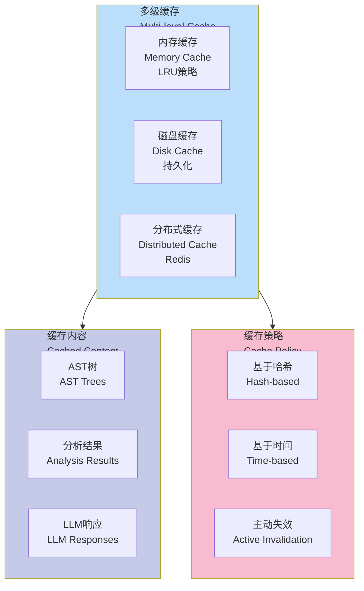

**缓存策略**：

1. **文件哈希**：基于文件内容的 SHA-256 哈希作为缓存键，文件未变更时直接使用缓存
2. **TTL 机制**：为 LLM 响应设置过期时间，避免模型升级后使用过时的结果
3. **主动失效**：监听文件变更事件，自动清理受影响文件的缓存
4. **智能预热**：项目启动时预加载核心文件的 AST，减少首次分析延迟

### 8.2 并行处理

```python
# 并行分析示例
from concurrent.futures import ThreadPoolExecutor
from typing import List

def analyze_file(file_path: str) -> AnalysisResult:
    """分析单个文件"""
    parser = get_parser(file_path)
    ast = parser.parse(file_path)
    return compute_metrics(ast)

def analyze_project(file_paths: List[str], max_workers: int = 4) -> List[AnalysisResult]:
    """并行分析项目"""
    with ThreadPoolExecutor(max_workers=max_workers) as executor:
        results = list(executor.map(analyze_file, file_paths))
    return results
```

**并行优化**：

* **文件级并行**：多个文件的分析相互独立,可并行执行，充分利用多核 CPU
* **模块级并行**：对于大型文件，可将 AST 分解为多个子树并行处理
* **批量 LLM 调用**：将多个小任务合并为批量请求，减少网络往返次数

---

## 9. 安全与隐私

### 9.1 数据安全

* **敏感信息过滤**：在发送至 LLM 前，自动检测并移除 API 密钥、密码等敏感信息
* **本地优先**：核心分析功能可在无网络环境下运行，降低数据泄露风险
* **审计日志**：记录所有外部 API 调用，支持事后审计与合规检查

### 9.2 访问控制（企业版）

* **角色权限**：支持管理员、开发者、审计员等多角色权限管理
* **项目隔离**：不同项目的分析结果完全隔离，防止交叉访问
* **API 认证**：Web API 支持 OAuth2/JWT 认证，保障接口安全

---

## 10. 主打场景方向

1. **语言支持扩展**：增加 Scala、Swift、Kotlin、TypeScript 等语言的一流支持
2. **IDE 深度集成**：开发 VSCode、IntelliJ IDEA 插件，提供实时分析与内联建议
3. **可视化增强**：提供交互式依赖图谱、复杂度热图等可视化工具
4. **增量分析优化**：实现基于 Git diff 的精准增量分析，进一步提升性能
5. **多仓库治理**：支持跨仓库的依赖分析与统一治理
6. **智能推荐系统**：基于历史数据，主动推荐优化建议与最佳实践
7. **自定义规则引擎**：提供 DSL 或可视化编辑器，支持企业自定义检测规则
8. **团队协作功能**：支持分析结果共享、评审流程与知识库沉淀

打造一个**AI 原生的代码智能平台**，实现从静态分析到动态修复、从单一工具到生态系统的跨越，成为开发团队不可或缺的智能助手。

---

## 参考资料

\[1] Tree-sitter - 增量解析系统
[https://tree-sitter.github.io/tree-sitter/](https://tree-sitter.github.io/tree-sitter/)

\[2] Click - Python 命令行框架
[https://click.palletsprojects.com/](https://click.palletsprojects.com/)

\[3] FastAPI - 现代 Python Web 框架
[https://fastapi.tiangolo.com/](https://fastapi.tiangolo.com/)

\[4] Anthropic SDK - Claude API 官方 SDK
[https://docs.anthropic.com/claude/reference/client-sdks](https://docs.anthropic.com/claude/reference/client-sdks)

\[5] OpenAI SDK - GPT API 官方 SDK
[https://platform.openai.com/docs/libraries](https://platform.openai.com/docs/libraries)

\[6] pytest - Python 测试框架
[https://docs.pytest.org/](https://docs.pytest.org/)

---

<div align="center">
  <sub>本文档持续更新 | 最后更新：2025-11-12</sub>
</div>
