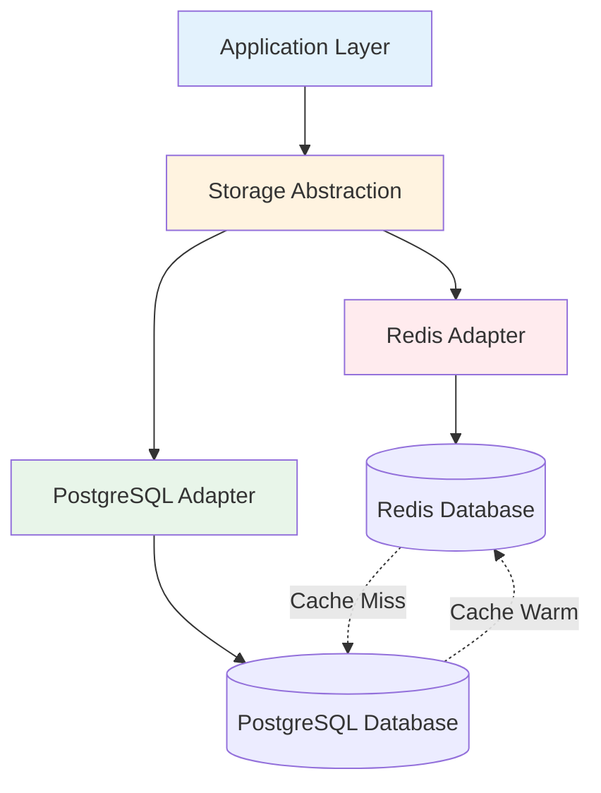

# Phase 2 Storage Schema Design

## Overview

This document describes the storage schema design for CodeSnapAI's Phase 2 semantic graph engine. The storage layer supports both Redis (for caching) and PostgreSQL (for persistence) through a unified abstraction layer.

## Storage Architecture

### Dual Storage Strategy



### Storage Characteristics

| Aspect | Redis | PostgreSQL |
|--------|-------|------------|
| **Purpose** | High-speed cache | Persistent storage |
| **Data Format** | MessagePack binary | JSONB + relational |
| **TTL** | 1 hour default | Permanent |
| **Consistency** | Eventually consistent | ACID compliant |
| **Query Capability** | Key-value + sets | Full SQL + recursive CTE |
| **Performance** | < 10ms read/write | < 100ms complex queries |

## Redis Storage Schema

### Key Naming Convention

```
codesage:graph:<type>:<identifier>
```

**Examples:**
- `codesage:graph:node:func:main.py:main_function`
- `codesage:graph:edges:func:main.py:main_function`
- `codesage:graph:type:function`
- `codesage:graph:edge_type:calls`

### Data Structures

#### Node Storage

```redis
# Node data (Hash)
HSET codesage:graph:node:{node_id}
  data: <msgpack_serialized_node>
  type: "function"
  created_at: "2025-12-07T10:30:00Z"
  ttl: 3600

# Type index (Set)
SADD codesage:graph:type:function {node_id}
```

#### Edge Storage

```redis
# Outgoing edges from a node (Hash)
HSET codesage:graph:edges:{source_id}
  {target_id}:{edge_type}: <msgpack_serialized_edge>

# Edge type index (Set)
SADD codesage:graph:edge_type:calls "{source_id}:{target_id}"
```

#### Example Redis Data

```redis
# Function node
HSET codesage:graph:node:func:main.py:calculate
  data: "\x84\xa2id\xb8func:main.py:calculate\xa4type\xa8function..."
  type: "function"

# Function calls edge
HSET codesage:graph:edges:func:main.py:calculate
  func:utils.py:helper:calls: "\x83\xa6source\xb8func:main.py:calculate..."

# Type indexes
SADD codesage:graph:type:function "func:main.py:calculate"
SADD codesage:graph:edge_type:calls "func:main.py:calculate:func:utils.py:helper"
```

### Redis Operations

#### Save Graph

```python
def save_graph(self, graph: Graph, ttl: int = 3600):
    pipe = self.redis.pipeline()
    
    # Save nodes
    for node in graph.nodes.values():
        node_key = f"codesage:graph:node:{node.id}"
        node_data = msgpack.packb(node.to_dict())
        
        pipe.hset(node_key, mapping={
            'data': node_data,
            'type': node.type,
            'created_at': datetime.utcnow().isoformat()
        })
        pipe.expire(node_key, ttl)
        
        # Add to type index
        type_key = f"codesage:graph:type:{node.type}"
        pipe.sadd(type_key, node.id)
        pipe.expire(type_key, ttl)
    
    # Save edges
    edges_by_source = defaultdict(dict)
    for edge in graph.edges:
        edge_key = f"{edge.target}:{edge.type}"
        edge_data = msgpack.packb(edge.to_dict())
        edges_by_source[edge.source][edge_key] = edge_data
    
    for source_id, edge_mapping in edges_by_source.items():
        edges_key = f"codesage:graph:edges:{source_id}"
        pipe.hset(edges_key, mapping=edge_mapping)
        pipe.expire(edges_key, ttl)
    
    pipe.execute()
```

#### Query Nodes

```python
def query_nodes(self, node_type: str, filters: Dict[str, Any]) -> List[Node]:
    # Get node IDs from type index
    type_key = f"codesage:graph:type:{node_type}"
    node_ids = self.redis.smembers(type_key)
    
    # Batch load nodes
    if node_ids:
        node_keys = [f"codesage:graph:node:{nid}" for nid in node_ids]
        node_data_list = self.redis.mget(node_keys)
        
        nodes = []
        for data in node_data_list:
            if data:
                node_dict = msgpack.unpackb(data)
                if self._apply_filters(node_dict, filters):
                    nodes.append(Node.from_dict(node_dict))
        
        return nodes
    return []
```

## PostgreSQL Storage Schema

### Table Definitions

#### Nodes Table

```sql
CREATE TABLE nodes (
    id VARCHAR(500) PRIMARY KEY,
    type VARCHAR(50) NOT NULL,
    properties JSONB NOT NULL,
    created_at TIMESTAMP DEFAULT NOW(),
    updated_at TIMESTAMP DEFAULT NOW()
);

-- Indexes for performance
CREATE INDEX idx_nodes_type ON nodes(type);
CREATE INDEX idx_nodes_properties_gin ON nodes USING GIN(properties);
CREATE INDEX idx_nodes_created_at ON nodes(created_at);
```

#### Edges Table

```sql
CREATE TABLE edges (
    id SERIAL PRIMARY KEY,
    source VARCHAR(500) NOT NULL,
    target VARCHAR(500) NOT NULL,
    type VARCHAR(50) NOT NULL,
    properties JSONB NOT NULL,
    created_at TIMESTAMP DEFAULT NOW(),
    
    -- Foreign key constraints
    CONSTRAINT fk_edges_source FOREIGN KEY (source) REFERENCES nodes(id) ON DELETE CASCADE,
    CONSTRAINT fk_edges_target FOREIGN KEY (target) REFERENCES nodes(id) ON DELETE CASCADE
);

-- Indexes for performance
CREATE INDEX idx_edges_source ON edges(source);
CREATE INDEX idx_edges_target ON edges(target);
CREATE INDEX idx_edges_type ON edges(type);
CREATE INDEX idx_edges_source_target ON edges(source, target);
CREATE INDEX idx_edges_properties_gin ON edges USING GIN(properties);
```

#### Metadata Table

```sql
CREATE TABLE graph_metadata (
    id SERIAL PRIMARY KEY,
    project_name VARCHAR(255) NOT NULL,
    version VARCHAR(50),
    created_at TIMESTAMP DEFAULT NOW(),
    node_count INTEGER DEFAULT 0,
    edge_count INTEGER DEFAULT 0,
    properties JSONB
);
```

### JSONB Property Schema

#### Function Node Properties

```json
{
  "name": "calculate_total",
  "qualified_name": "finance.calculator.calculate_total",
  "line_start": 45,
  "line_end": 67,
  "complexity": 8,
  "params": ["amount", "tax_rate", "discount"],
  "return_type": "float",
  "is_async": false,
  "is_generator": false,
  "decorators": ["@cached", "@validate_input"],
  "docstring": "Calculate total amount with tax and discount",
  "file_path": "/src/finance/calculator.py",
  "language": "python"
}
```

#### Class Node Properties

```json
{
  "name": "PaymentProcessor",
  "qualified_name": "payment.processors.PaymentProcessor",
  "line_start": 12,
  "line_end": 156,
  "base_classes": ["BaseProcessor", "Loggable"],
  "methods": ["process_payment", "validate_card", "send_receipt"],
  "method_count": 15,
  "is_abstract": false,
  "attributes": ["api_key", "timeout", "retry_count"],
  "decorators": ["@dataclass"],
  "file_path": "/src/payment/processors.py",
  "language": "python"
}
```

#### Edge Properties

```json
{
  "call_site": 78,
  "call_type": "direct",
  "arguments": ["user_id", "amount"],
  "context": "payment_processing",
  "confidence": 0.95
}
```

### PostgreSQL Operations

#### Save Graph with Transactions

```sql
BEGIN;

-- Insert nodes with conflict resolution
INSERT INTO nodes (id, type, properties, updated_at)
VALUES 
  ('func:main.py:calculate', 'function', '{"name": "calculate", ...}', NOW()),
  ('class:main.py:Calculator', 'class', '{"name": "Calculator", ...}', NOW())
ON CONFLICT (id) DO UPDATE SET
  properties = EXCLUDED.properties,
  updated_at = NOW();

-- Insert edges
INSERT INTO edges (source, target, type, properties)
VALUES 
  ('func:main.py:main', 'func:main.py:calculate', 'calls', '{"call_site": 15}'),
  ('class:main.py:Calculator', 'func:main.py:calculate', 'contains', '{"line_number": 25}')
ON CONFLICT DO NOTHING;

COMMIT;
```

#### Recursive Graph Traversal

```sql
-- Find all functions reachable from a root function
WITH RECURSIVE function_calls AS (
    -- Base case: start from root function
    SELECT 
        n.id,
        n.properties->>'name' as name,
        e.target,
        0 as depth
    FROM nodes n
    LEFT JOIN edges e ON n.id = e.source AND e.type = 'calls'
    WHERE n.id = 'func:main.py:main'
    
    UNION ALL
    
    -- Recursive case: follow call edges
    SELECT 
        n.id,
        n.properties->>'name' as name,
        e.target,
        fc.depth + 1
    FROM function_calls fc
    JOIN edges e ON fc.target = e.source AND e.type = 'calls'
    JOIN nodes n ON e.target = n.id
    WHERE fc.depth < 5  -- Limit recursion depth
)
SELECT DISTINCT id, name, depth
FROM function_calls
ORDER BY depth, name;
```

#### Complex JSONB Queries

```sql
-- Find high-complexity functions with specific patterns
SELECT 
    id,
    properties->>'name' as function_name,
    (properties->>'complexity')::integer as complexity,
    properties->>'file_path' as file_path
FROM nodes
WHERE type = 'function'
  AND (properties->>'complexity')::integer > 10
  AND properties->>'name' LIKE 'process_%'
  AND properties ? 'is_async'
  AND (properties->>'is_async')::boolean = true
ORDER BY (properties->>'complexity')::integer DESC;
```

## Storage Abstraction Layer

### Interface Definition

```python
class StorageAdapter(ABC):
    """Abstract storage adapter interface"""
    
    @abstractmethod
    def save_graph(self, graph: Graph, **kwargs) -> None:
        """Save complete graph"""
        pass
    
    @abstractmethod
    def load_graph(self, root_node_id: str, max_depth: int = 10) -> Graph:
        """Load graph from root node"""
        pass
    
    @abstractmethod
    def query_nodes(self, node_type: str, filters: Dict[str, Any], 
                   limit: int = 100, offset: int = 0) -> List[Node]:
        """Query nodes with filters"""
        pass
    
    @abstractmethod
    def transaction(self) -> ContextManager[None]:
        """Transaction context manager"""
        pass
```

### Configuration Management

#### Redis Configuration

```yaml
# configs/storage/redis.yaml
redis:
  host: localhost
  port: 6379
  db: 0
  password: null
  socket_timeout: 5
  max_connections: 50
  key_prefix: "codesage:graph"
  default_ttl: 3600
  
  # Connection pool settings
  pool:
    max_connections: 50
    retry_on_timeout: true
    socket_keepalive: true
    socket_keepalive_options: {}
```

#### PostgreSQL Configuration

```yaml
# configs/storage/postgres.yaml
postgresql:
  host: localhost
  port: 5432
  database: codesage
  username: codesage
  password: codesage
  
  # Connection pool settings
  pool:
    pool_size: 20
    max_overflow: 50
    pool_timeout: 30
    pool_recycle: 3600
    pool_pre_ping: true
  
  # Query settings
  query:
    statement_timeout: 30000  # 30 seconds
    lock_timeout: 10000       # 10 seconds
    
  # Performance settings
  performance:
    work_mem: "256MB"
    shared_buffers: "1GB"
    effective_cache_size: "4GB"
```

## Data Migration and Versioning

### Schema Versioning

```sql
CREATE TABLE schema_versions (
    version VARCHAR(20) PRIMARY KEY,
    applied_at TIMESTAMP DEFAULT NOW(),
    description TEXT
);

-- Track current schema version
INSERT INTO schema_versions (version, description)
VALUES ('2.0.0', 'Initial graph storage schema');
```

### Migration Scripts

#### Migration: Add Node Metadata

```sql
-- Migration: 2.0.1 - Add node metadata
ALTER TABLE nodes ADD COLUMN metadata JSONB DEFAULT '{}';
CREATE INDEX idx_nodes_metadata_gin ON nodes USING GIN(metadata);

INSERT INTO schema_versions (version, description)
VALUES ('2.0.1', 'Add node metadata column');
```

#### Migration: Edge Weights

```sql
-- Migration: 2.0.2 - Add edge weights
ALTER TABLE edges ADD COLUMN weight FLOAT DEFAULT 1.0;
CREATE INDEX idx_edges_weight ON edges(weight);

INSERT INTO schema_versions (version, description)
VALUES ('2.0.2', 'Add edge weight support');
```

## Performance Optimization

### Indexing Strategy

#### PostgreSQL Indexes

```sql
-- Composite indexes for common query patterns
CREATE INDEX idx_nodes_type_properties ON nodes(type, (properties->>'name'));
CREATE INDEX idx_edges_source_type ON edges(source, type);
CREATE INDEX idx_edges_target_type ON edges(target, type);

-- Partial indexes for specific conditions
CREATE INDEX idx_high_complexity_functions 
ON nodes((properties->>'complexity')::integer) 
WHERE type = 'function' AND (properties->>'complexity')::integer > 10;

-- Expression indexes for computed values
CREATE INDEX idx_function_loc 
ON nodes(((properties->>'line_end')::integer - (properties->>'line_start')::integer))
WHERE type = 'function';
```

#### Redis Optimization

```python
# Use pipeline for batch operations
def batch_save_nodes(self, nodes: List[Node], batch_size: int = 1000):
    for i in range(0, len(nodes), batch_size):
        batch = nodes[i:i + batch_size]
        pipe = self.redis.pipeline()
        
        for node in batch:
            # Add operations to pipeline
            self._add_node_to_pipeline(pipe, node)
        
        # Execute batch
        pipe.execute()
```

### Query Optimization

#### Query Plan Analysis

```sql
-- Analyze query performance
EXPLAIN (ANALYZE, BUFFERS) 
SELECT n.id, n.properties->>'name'
FROM nodes n
JOIN edges e ON n.id = e.target
WHERE n.type = 'function' 
  AND e.type = 'calls'
  AND e.source = 'func:main.py:main';
```

#### Caching Strategy

```python
class CachedStorageAdapter:
    """Storage adapter with intelligent caching"""
    
    def __init__(self, redis_adapter: RedisStorageAdapter, 
                 postgres_adapter: PostgreSQLStorageAdapter):
        self.redis = redis_adapter
        self.postgres = postgres_adapter
    
    def query_nodes(self, node_type: str, filters: Dict[str, Any]) -> List[Node]:
        # Try Redis cache first
        cache_key = self._generate_cache_key(node_type, filters)
        cached_result = self.redis.get(cache_key)
        
        if cached_result:
            return msgpack.unpackb(cached_result)
        
        # Fallback to PostgreSQL
        result = self.postgres.query_nodes(node_type, filters)
        
        # Cache result in Redis
        self.redis.setex(
            cache_key, 
            self.redis.config.default_ttl,
            msgpack.packb(result)
        )
        
        return result
```

## Monitoring and Metrics

### Storage Metrics

```python
class StorageMetrics:
    """Storage performance metrics"""
    
    def __init__(self):
        self.redis_hits = 0
        self.redis_misses = 0
        self.postgres_queries = 0
        self.avg_query_time = 0.0
    
    @property
    def cache_hit_ratio(self) -> float:
        total = self.redis_hits + self.redis_misses
        return self.redis_hits / total if total > 0 else 0.0
    
    def record_redis_hit(self):
        self.redis_hits += 1
    
    def record_redis_miss(self):
        self.redis_misses += 1
    
    def record_postgres_query(self, duration: float):
        self.postgres_queries += 1
        self.avg_query_time = (
            (self.avg_query_time * (self.postgres_queries - 1) + duration) /
            self.postgres_queries
        )
```

### Health Checks

```python
def health_check() -> Dict[str, Any]:
    """Check storage system health"""
    health = {
        'redis': {'status': 'unknown', 'latency_ms': None},
        'postgresql': {'status': 'unknown', 'latency_ms': None}
    }
    
    # Redis health check
    try:
        start = time.time()
        redis_adapter.redis.ping()
        health['redis'] = {
            'status': 'healthy',
            'latency_ms': (time.time() - start) * 1000
        }
    except Exception as e:
        health['redis'] = {'status': 'unhealthy', 'error': str(e)}
    
    # PostgreSQL health check
    try:
        start = time.time()
        postgres_adapter.get_node_count()
        health['postgresql'] = {
            'status': 'healthy',
            'latency_ms': (time.time() - start) * 1000
        }
    except Exception as e:
        health['postgresql'] = {'status': 'unhealthy', 'error': str(e)}
    
    return health
```

## Backup and Recovery

### PostgreSQL Backup

```bash
# Full database backup
pg_dump -h localhost -U codesage -d codesage > codesage_backup.sql

# Schema-only backup
pg_dump -h localhost -U codesage -d codesage --schema-only > schema_backup.sql

# Data-only backup
pg_dump -h localhost -U codesage -d codesage --data-only > data_backup.sql
```

### Redis Backup

```bash
# Redis snapshot
redis-cli BGSAVE

# Export specific keys
redis-cli --scan --pattern "codesage:graph:*" | xargs redis-cli DUMP > graph_backup.rdb
```

### Recovery Procedures

```python
def restore_from_backup(backup_file: str, storage_adapter: StorageAdapter):
    """Restore graph data from backup"""
    with open(backup_file, 'r') as f:
        backup_data = json.load(f)
    
    # Clear existing data
    storage_adapter.clear_all()
    
    # Restore nodes
    for node_data in backup_data['nodes']:
        node = Node.from_dict(node_data)
        storage_adapter.save_node(node)
    
    # Restore edges
    for edge_data in backup_data['edges']:
        edge = Edge.from_dict(edge_data)
        storage_adapter.save_edge(edge)
```

This storage schema design provides a robust, scalable foundation for CodeSnapAI's semantic graph engine, supporting both high-performance caching and reliable persistence with comprehensive query capabilities.