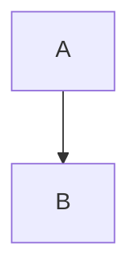

# CodeSage Analysis Report

**Generated:** 2023-10-27T10:00:00Z
**Version:** v1
**Git Commit:** a1b2c3d4

---

## 📊 Project Overview

| Metric                | Value      |
|-----------------------|------------|
| Total Files           | 1          |
| Total Lines of Code   | 150        |
| Languages             | python     |
| Average Complexity    | 15.00      |

---

## 🔥 Complexity Hotspots

_Top 10 most complex functions_

| Rank | Function Name | Complexity | Lines | Location |
|------|---------------|------------|-------|----------|
| 1    | `some_func`   | **15**     | 50    | `src/main.py:25` |

---

## 🔗 Dependency Graph

---

## 🎨 Detected Patterns

No design patterns were detected.

---

## ⚠️ Issues

No issues were found.
